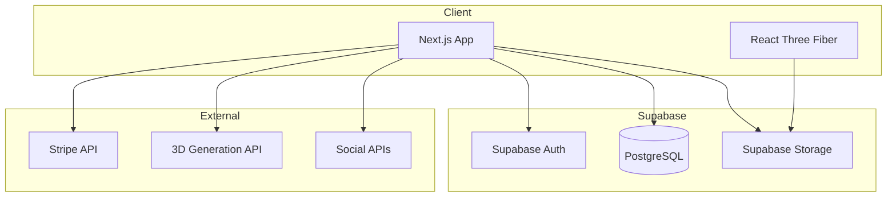
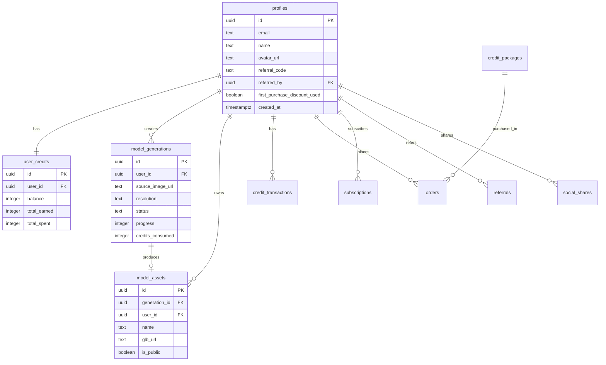

# Design Document - Morphix AI Platform

## Overview

Morphix AI 是一个面向全球市场的 AI 驱动 2D 转 3D 模型生成平台。本设计文档详细描述系统架构、组件接口、数据模型和实现策略。

### 核心目标
- 提供高质量的 2D 图片转 3D 模型服务
- 实现积分制商业模式，支持 Stripe 支付
- 全站中英文双语支持
- 病毒式增长机制（邀请奖励 + 社交分享）

### 技术栈
- **前端**: Next.js 15 (App Router) + React 19
- **UI**: Radix UI + Tailwind CSS + Framer Motion
- **3D**: React Three Fiber + Three.js
- **后端**: Supabase (Auth + PostgreSQL + Storage)
- **支付**: Stripe
- **国际化**: next-intl

---

## Architecture

### 系统架构图



### 目录结构

```
src/
├── app/
│   └── [locale]/
│       ├── page.tsx              # 首页
│       ├── features/page.tsx     # 功能页
│       ├── pricing/page.tsx      # 定价页
│       ├── about/page.tsx        # 关于页
│       ├── login/page.tsx        # 登录页
│       ├── signup/page.tsx       # 注册页
│       ├── dashboard/page.tsx    # 仪表盘
│       ├── create/page.tsx       # 创建页
│       ├── settings/page.tsx     # 设置页
│       └── ref/[code]/page.tsx   # 邀请链接页
├── components/
│   ├── ui/                       # 基础UI组件
│   ├── canvas/                   # 3D渲染组件
│   ├── layout/                   # 布局组件
│   └── features/                 # 功能组件
├── lib/
│   ├── supabase/                 # Supabase客户端
│   ├── stripe/                   # Stripe集成
│   └── utils/                    # 工具函数
├── hooks/                        # 自定义Hooks
├── types/                        # TypeScript类型
└── i18n/                         # 国际化配置
```

---

## Components and Interfaces

### 1. 认证模块 (Auth Module)

```typescript
// lib/supabase/auth.ts
interface AuthService {
  signUp(email: string, password: string, referralCode?: string): Promise<AuthResult>;
  signIn(email: string, password: string): Promise<AuthResult>;
  signOut(): Promise<void>;
  resetPassword(email: string): Promise<void>;
  getSession(): Promise<Session | null>;
}

interface AuthResult {
  user: User | null;
  error: AuthError | null;
}
```

### 2. 积分模块 (Credits Module)

```typescript
// lib/credits/service.ts
interface CreditsService {
  getBalance(userId: string): Promise<number>;
  deductCredits(userId: string, amount: number, reason: string): Promise<TransactionResult>;
  addCredits(userId: string, amount: number, reason: string): Promise<TransactionResult>;
  refundCredits(userId: string, generationId: string): Promise<TransactionResult>;
  getTransactionHistory(userId: string): Promise<CreditTransaction[]>;
}

interface TransactionResult {
  success: boolean;
  newBalance: number;
  transactionId: string;
  error?: string;
}
```

### 3. 生成模块 (Generation Module)

```typescript
// lib/generation/service.ts
interface GenerationService {
  createTask(userId: string, imageUrl: string, resolution: Resolution): Promise<GenerationTask>;
  getTaskStatus(taskId: string): Promise<TaskStatus>;
  cancelTask(taskId: string): Promise<void>;
  getTaskHistory(userId: string): Promise<GenerationTask[]>;
}

type Resolution = '512' | '1024' | '1536';
type TaskStatus = 'PENDING' | 'PROCESSING' | 'COMPLETED' | 'FAILED';

interface GenerationTask {
  id: string;
  userId: string;
  sourceImageUrl: string;
  resolution: Resolution;
  status: TaskStatus;
  progress: number;
  creditsConsumed: number;
  createdAt: Date;
  completedAt?: Date;
  modelAsset?: ModelAsset;
  errorMessage?: string;
}
```

### 4. 资产模块 (Assets Module)

```typescript
// lib/assets/service.ts
interface AssetsService {
  getAssets(userId: string): Promise<ModelAsset[]>;
  getAsset(assetId: string): Promise<ModelAsset>;
  deleteAsset(assetId: string): Promise<void>;
  updateAsset(assetId: string, updates: Partial<ModelAsset>): Promise<ModelAsset>;
  getDownloadUrl(assetId: string, format: ExportFormat): Promise<string>;
}

type ExportFormat = 'glb' | 'obj' | 'fbx';

interface ModelAsset {
  id: string;
  generationId: string;
  userId: string;
  name: string;
  thumbnailUrl: string;
  glbUrl: string;
  objUrl?: string;
  fbxUrl?: string;
  vertexCount: number;
  faceCount: number;
  fileSizeBytes: number;
  isPublic: boolean;
  downloadCount: number;
  createdAt: Date;
}
```

### 5. 邀请模块 (Referral Module)

```typescript
// lib/referral/service.ts
interface ReferralService {
  getReferralCode(userId: string): Promise<string>;
  getReferralLink(userId: string): Promise<string>;
  processReferral(referralCode: string, newUserId: string): Promise<ReferralResult>;
  getReferralStats(userId: string): Promise<ReferralStats>;
  getReferralHistory(userId: string): Promise<Referral[]>;
}

interface ReferralResult {
  success: boolean;
  referrerCreditsAwarded: number;
  refereeCreditsAwarded: number;
  error?: string;
}

interface ReferralStats {
  totalReferrals: number;
  totalCreditsEarned: number;
  remainingSlots: number; // 50 - totalReferrals
}
```

### 6. 社交分享模块 (Social Share Module)

```typescript
// lib/social/service.ts
interface SocialShareService {
  shareToTwitter(modelId: string, userId: string): Promise<ShareResult>;
  shareToTikTok(modelId: string, userId: string): Promise<ShareResult>;
  shareToReddit(modelId: string, userId: string): Promise<ShareResult>;
  shareToLinkedIn(modelId: string, userId: string): Promise<ShareResult>;
  shareToFacebook(modelId: string, userId: string): Promise<ShareResult>;
  getDailyShareCredits(userId: string): Promise<number>;
  getShareHistory(userId: string): Promise<SocialShare[]>;
}

type SocialPlatform = 'TWITTER' | 'TIKTOK' | 'REDDIT' | 'LINKEDIN' | 'FACEBOOK';

interface ShareResult {
  success: boolean;
  creditsAwarded: number;
  shareUrl: string;
  error?: string;
}
```

### 7. 支付模块 (Payment Module)

```typescript
// lib/stripe/service.ts
interface PaymentService {
  createCheckoutSession(userId: string, packageId: string): Promise<CheckoutSession>;
  createSubscription(userId: string, planId: string): Promise<Subscription>;
  cancelSubscription(subscriptionId: string): Promise<void>;
  handleWebhook(event: Stripe.Event): Promise<void>;
  applyFirstPurchaseDiscount(userId: string, amount: number): Promise<number>;
}

interface CheckoutSession {
  sessionId: string;
  url: string;
}
```

---

## Data Models

### Entity Relationship Diagram



### 积分消耗规则

| 分辨率 | 积分消耗 |
|-------|---------|
| 512 (标准) | 10 积分 |
| 1024 (高清) | 15 积分 |
| 1536 (超清) | 35 积分 |
| 多视角 | +15 积分 |

---

## Correctness Properties

*A property is a characteristic or behavior that should hold true across all valid executions of a system-essentially, a formal statement about what the system should do. Properties serve as the bridge between human-readable specifications and machine-verifiable correctness guarantees.*

Based on the prework analysis, the following correctness properties have been identified:

### Property 1: New User Credit Initialization
*For any* valid user registration, the system should create a user account with exactly 10 initial credits and record a BONUS transaction.
**Validates: Requirements 1.2, 3.1**

### Property 2: Credit Deduction Consistency
*For any* generation task initiated by a user with sufficient credits, the credit balance should decrease by exactly the amount specified for the resolution (10/15/35 credits), and a CONSUME transaction should be recorded.
**Validates: Requirements 3.2, 5.2**

### Property 3: Insufficient Credits Blocking
*For any* user with credits less than the required amount for a generation task, the system should reject the task and not deduct any credits.
**Validates: Requirements 3.3**

### Property 4: Transaction Logging Completeness
*For any* credit balance change (addition or deduction), a corresponding transaction record should exist with correct balance_before and balance_after values.
**Validates: Requirements 3.5**

### Property 5: File Validation Correctness
*For any* uploaded file, the system should accept only JPG, PNG, WEBP formats under 20MB and reject all others with appropriate error messages.
**Validates: Requirements 5.1**

### Property 6: Generation Failure Refund
*For any* generation task that fails, the system should refund the exact amount of credits consumed and record a REFUND transaction.
**Validates: Requirements 5.5**

### Property 7: Referral Credit Distribution
*For any* successful referral (new user registers with valid referral code), both the referrer and referee should receive exactly 15 credits each.
**Validates: Requirements 10.2**

### Property 8: Referral Limit Enforcement
*For any* user who has already referred 50 users, subsequent referrals should not award any credits to the referrer.
**Validates: Requirements 10.3**

### Property 9: Social Share Credit Award
*For any* first-time share of a model to a specific platform, the user should receive the correct credits (5 for Twitter/TikTok/Reddit/LinkedIn, 3 for Facebook).
**Validates: Requirements 11.2-11.6**

### Property 10: Social Share Daily Limit
*For any* user who has earned 20 or more credits from sharing in a single day, subsequent shares should not award additional credits until the next day.
**Validates: Requirements 11.7**

### Property 11: Social Share Duplicate Prevention
*For any* attempt to share the same model to the same platform twice, the system should not award additional credits.
**Validates: Requirements 11.8**

### Property 12: First Purchase Discount Application
*For any* user making their first purchase, the system should apply exactly 15% discount (8.5折) to the total amount.
**Validates: Requirements 12.2**

### Property 13: First Purchase Discount Single Use
*For any* user who has completed a purchase, subsequent purchases should not receive the first-purchase discount.
**Validates: Requirements 12.3, 12.4**

### Property 14: Unique Referral Code Generation
*For any* user, the system should generate a unique referral code that does not conflict with any existing codes.
**Validates: Requirements 10.1**

### Property 15: Language Content Consistency
*For any* page and selected language, all translatable content should be displayed in that language.
**Validates: Requirements 9.1, 9.2**

---

## Error Handling

### Error Categories

1. **Authentication Errors**
   - Invalid credentials
   - Session expired
   - Account not verified

2. **Credit Errors**
   - Insufficient balance
   - Transaction failed

3. **Generation Errors**
   - Invalid file format
   - File too large
   - Generation timeout
   - AI service unavailable

4. **Payment Errors**
   - Payment declined
   - Stripe webhook failure

5. **Referral Errors**
   - Invalid referral code
   - Self-referral attempt
   - Referral limit reached

### Error Response Format

```typescript
interface ErrorResponse {
  code: string;
  message: string;
  details?: Record<string, unknown>;
}
```

---

## Testing Strategy

### Unit Testing
- Use Vitest for unit tests
- Test individual service functions
- Mock external dependencies (Supabase, Stripe)

### Property-Based Testing
- Use fast-check library for property-based tests
- Each correctness property should have a corresponding PBT
- Minimum 100 iterations per property test

### Integration Testing
- Test API routes with real Supabase (test project)
- Test Stripe integration with test mode
- Test social share flows with mocked APIs

### E2E Testing
- Use Playwright for end-to-end tests
- Test critical user flows:
  - Registration → Free generation → Purchase
  - Referral flow
  - Social share flow

### Test File Structure

```
__tests__/
├── unit/
│   ├── credits.test.ts
│   ├── referral.test.ts
│   └── social.test.ts
├── property/
│   ├── credits.property.test.ts
│   ├── referral.property.test.ts
│   └── social.property.test.ts
└── e2e/
    ├── auth.spec.ts
    ├── generation.spec.ts
    └── payment.spec.ts
```
